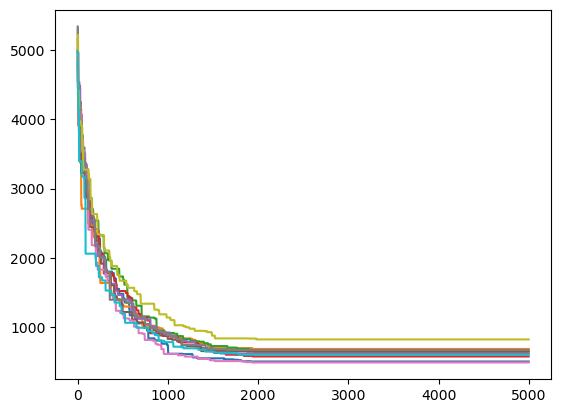

# Algoritmo genetico per il Set Cover Problem (SCP)

## Set Cover Problem

Il problema del Set Cover riguarda un insieme chiamato universo di $n$ elementi: $I = \{ 1, 2, \dots, n \}$ e un insieme di m suoi sottoinsiemi $T = \{ S_1, S_2, \dots, S_m \}$, con un costo associato ad ognuno di questi sottoinsiemi: $c = [c_1, c_2, \dots, c_m]$.

Risolvere il problema del Set Cover vuol dire trovare un gruppo di sottoinsiemi $S = \{ S_{i_1}, S_{i_2}, \dots, S_{i_p} \}$, $p \leq m$ tali che la loro unione sia l'insieme universo: $I = \bigcup_{j=1}^p S_{i_j}$ e tale che il loro costo: $\sum_{j=1}^p c_{i_j}$ sia minimo.

## Algoritmo Genetico

Un algoritmo genetico consiste nella risoluzione di un problema tramite un processo ispirato dalla teoria dell'evoluzione, il darwinismo e dalla genetica.

Il generico algoritmo genetico è un algoritmo di ottimizzazione e segue i seguenti passi:

``` python
genera_popolazione_iniziale
valuta_popolazione
loop fino a condizione_di_arresto:
    genera_mating_pool
    genera_figli_tramite_crossover
    muta_figli
    aggiungi_figli_alla_popolazione
    valuta_popolazione
end loop
return valore_ottimo_trovato
```

Per applicare un algoritmo genetico ad un problema è necessario definire: la funzione di fitness da ottimizzare $f$, gli operatori di *crossover* e *mutazione*, il metodo per generare la *mating pool* e per aggiungere i figli creati alla popolazione (gli elementi della popolazione sono chiamati individui).

## Applicazione algoritmo genetico al SCP

Mi sono basato sull'algoritmo proposto da J.E. Beasley e P.C. Chu nel loro articolo: "[A genetic algorithm for the set covering problem](https://www.sciencedirect.com/science/article/abs/pii/037722179500159X)". Adattandolo in python.

### Rappresentazione del problema

I parametri del SCP sono rappresentati nel seguente modo:

- L'insieme universo $I$ e i sottoinsiemi da scegliere $T$ sono rappresentati insieme tramite una matrice $U$ di dimensione $m \times n$ dove $m$ è il numero di elementi dell'insieme universo, e $n$ il numero di sottoinsiemi da poter scegliere. Le colonne di questa matrice sono vettori binari di $m$ elementi:
  $$U[i, j] =
  \begin{cases}
  1 & i \in S_j\\
  0 & i \notin S_j
  \end{cases}$$
- Una soluzione al problema del Set Cover è similmente rappresentato da un vettore binario $s$ di $n$ elementi:
  $$s[j] = \begin{cases}
  1 & \text{se $S_j$ è incluso nella soluzione} \\
  0 & altrimenti
  \end{cases}$$
- I costi sono un vettore di $n$ elementi che rappresentano il costo associato a ciascun sottoinsieme: $c[j]$ è il costo di includere $S_j$ nella soluzione.

Queste rappresentazioni portano ad una convenienza per il calcolo della funzione obiettivo di una soluzione: basta fare il prodotto puntuale tra il vettore soluzione $s$ e il vettore di costo $c$:
$$f(s) = \sum_{i=1}^n s_ic_i = s \cdot c$$

#### Crossover

Per generare il figlio $c$ a partire dai due genitori $p_1$ e $p_2$, si utilizza un operatore di *fusione*, che tramanda i bit dei genitori al figlio con probabilità relativa alla funzione di fitness del genitore. La fusione è definita nel seguente modo:
$$c[i] = \begin{cases}
p_1[i] & \text{con probabilità } p = \frac{f(p_2)}{f(p_1) + f(p_2)} \\
p_2[i] & \text{con probabilità } 1 - p
\end{cases}$$

#### Mutazione

L'operatore di mutazione modifica una soluzione. L'idea è quella di bilanciare *exploitation* e *exploration*. Nell'operatore utilizzato, il risultato voluto è quello di aumentare le modifiche fatte dalla mutazione (exploration) quando l'algoritmo converge. Questo si fa modificando un numero di bit dell'individuo dato dalla seguente formula:
$$\Biggl\lceil{\frac{m_f}{1+e^{-4m_g\frac{t-m_c}{m_f}}}}\Biggr\rceil$$
Dove $m_f$ rappresenta il mutation rate quando l'algoritmo si stabilizza, $m_c$ il numero di figli generati quando si raggiunge un mutation rate di $\frac{m_f}{2}$, e $m_g$ il gradiente quando $t=m_c$, e $t$ il numero di figli generati fino ad ora. Il risultato è quello di aumentare i bit modificati quando l'algoritmo converge:


Siccome questi bit sono presi a caso, quando si muta una soluzione nel SCP, si introduce un problema: La soluzione potrebbe non essere più ammissibile, perciò è necessario renderla ammissibile tramite un processo chiamato *Heuristic feasibility operator*, illustrato nell'[articolo](https://www.sciencedirect.com/science/article/abs/pii/037722179500159X). Riassunto:

1. Trova gli elementi non inclusi nella soluzione
2. Aggiungi colonne alla soluzione minimizzando l'euristica $\frac{\text{costo della colonna}}{\text{numero di elementi che il sottoinsieme contiene}}$
3. Rimuovi le colonne ridondanti, iniziando da quelle di costo maggiore

#### Generare la Mating Pool

La mating pool si genera attraverso un tournament binario: Si prendono 2 pool di 2 elementi ciascuno presi a caso dalla popolazione. I genitori eletti sono gli elementi che hanno fitness migliore all'interno della propria pool.

#### Modello di rimpiazzo della popolazione

Una volta generato il figlio, questo rimpiazzerà un individuo della popolazione preso a caso tra gli individui che hanno una fitness che è maggiore della media (fitness maggiore della media significa peggiore, dato che è un problema di minimizzazione). Questo metodo si chiama *steady-state replacement* e mantiene sempre il migliore individuo all'interno della popolazione, ma bisogna stare attenti a non introdurre copie dello stesso individuo all'interno della popolazione.

## Risultati

I problemi presi come test sono i problemi dal 4.1 al 4.10, utilizzati nell'[articolo](https://www.sciencedirect.com/science/article/abs/pii/037722179500159X), presi dal sito: https://people.brunel.ac.uk/%7Emastjjb/jeb/orlib/scpinfo.html

I valori dei vari parametri sono nella cartella `logs`.

La seguente tabella mostra la media dei risultati ottenuti su 10 iterazioni dell'algoritmo confrontati con i risultati ottimali:

|Problema| migliore trovato $f_{best}$ | ottimo $f_{ott}$ | Proporzione $\frac{f_{best} - f_{ott}}{f_{ott}}$ |
| -- | ----- | ----- | ---- |
|4.1 | 503.5 | 429.0 | 0.17 |
|4.2 | 628.7 | 512.0 | 0.22 |
|4.3 | 621.3 | 516.0 | 0.20 |
|4.4 | 601.5 | 494.0 | 0.21 |
|4.5 | 641.6 | 512.0 | 0.25 |
|4.6 | 652.8 | 560.0 | 0.16 |
|4.7 | 527.3 | 430.0 | 0.22 |
|4.8 | 607.2 | 492.0 | 0.23 |
|4.9 | 786.7 | 641.0 | 0.22 |
|4.10| 625.2 | 514.0 | 0.21 |

grafico della convergenza degli algoritmi:


